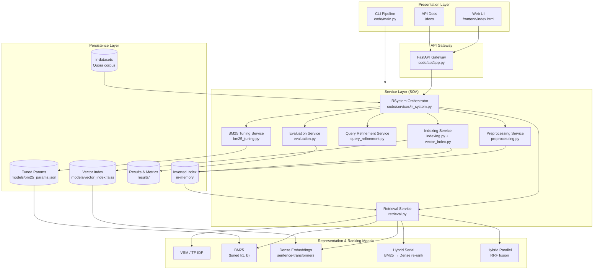
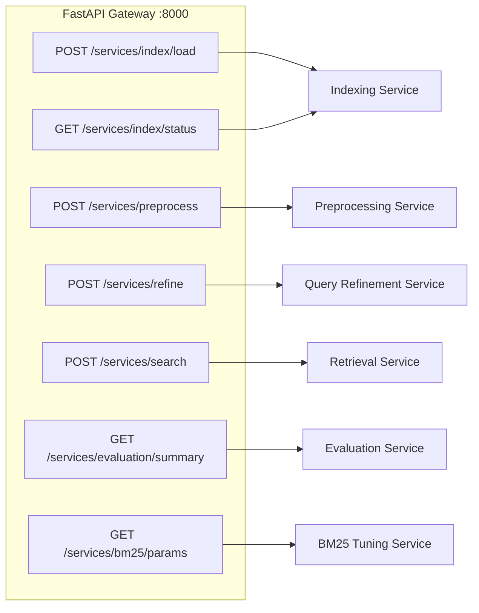
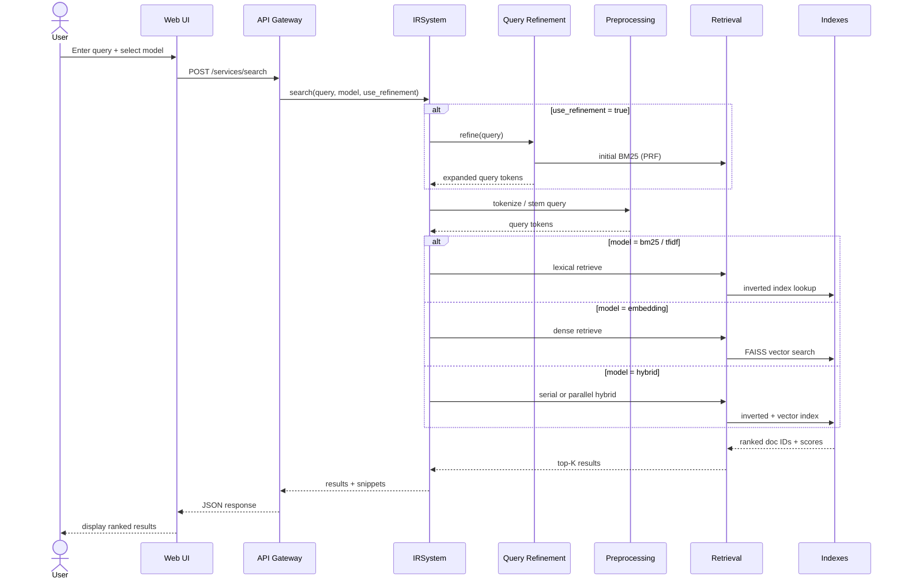
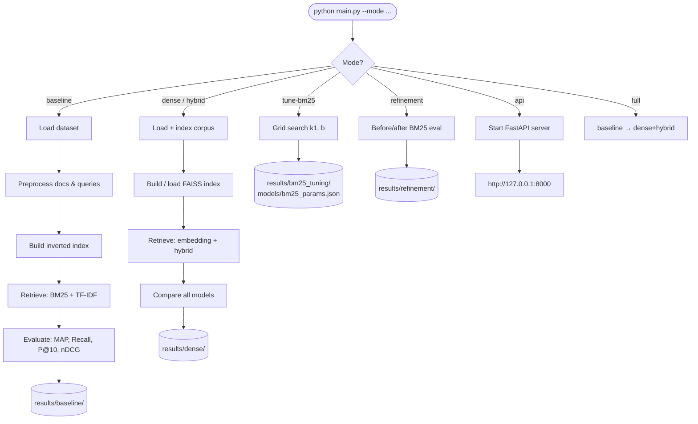
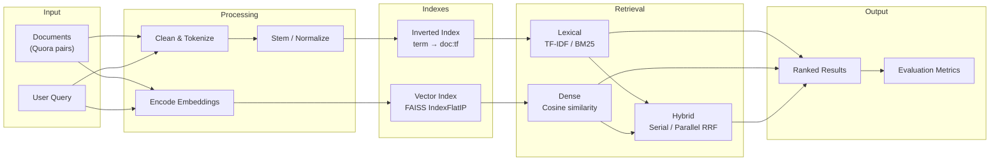

# IR Project 2026 — System Architecture Diagram

**Project:** Information Retrieval System  
**Architecture style:** Service-Oriented Architecture (SOA)  
**Dataset:** `beir/quora/test` (ir-datasets)  
**Stack:** Python, FastAPI, FAISS, sentence-transformers, NLTK

---

## 1. High-Level SOA Architecture



---

## 2. Service Endpoints (REST API)



| Service | REST endpoint | Module |
|---------|---------------|--------|
| API Gateway | `/`, `/health`, `/docs` | `code/api/app.py` |
| Indexing | `/services/index/load`, `/status` | `indexing.py`, `vector_index.py` |
| Preprocessing | `/services/preprocess` | `preprocessing.py` |
| Query Refinement | `/services/refine` | `query_refinement.py` |
| Retrieval | `/services/search` | `retrieval.py` |
| Evaluation | `/services/evaluation/summary` | `evaluation.py` |
| BM25 Tuning | `/services/bm25/params` | `bm25_tuning.py` |

---

## 3. Search Request Flow (Sequence)



---

## 4. Offline Evaluation Pipeline (CLI)



---

## 5. Data Flow Diagram



---

## 6. Component Map (Codebase)

```
IR-2026-project/
├── code/
│   ├── main.py              # CLI orchestrator (baseline, dense, hybrid, tuning, refinement, api)
│   ├── config.py            # Global configuration
│   ├── data_loader.py       # ir-datasets loader
│   ├── preprocessing.py     # Preprocessing Service
│   ├── indexing.py          # Inverted Index Service
│   ├── vector_index.py      # Vector Index Service (FAISS)
│   ├── embeddings.py        # Sentence-transformers encoder
│   ├── retrieval.py         # Retrieval Service (lexical, dense, hybrid)
│   ├── query_refinement.py  # Query Refinement Service
│   ├── evaluation.py        # Evaluation Service
│   ├── bm25_tuning.py       # BM25 parameter tuning
│   ├── api/app.py           # API Gateway (FastAPI)
│   └── services/ir_system.py # SOA service orchestrator
├── frontend/index.html        # Web search UI
├── models/                    # Cached indexes & tuned params
├── results/                   # Evaluation artifacts
└── data/                      # Downloaded dataset (ir_datasets)
```

---

## 7. Design Principles (SOA)

| Principle | How it is applied |
|-----------|-------------------|
| **Loose coupling** | UI and CLI talk to services only through REST API or `IRSystem` interface |
| **Reusability** | Core modules (`retrieval`, `evaluation`, `preprocessing`) shared by CLI and API |
| **Separation of concerns** | Each service has a single responsibility |
| **Independent testing** | Each module can be run/tested separately (`main.py --mode ...`) |
| **Scalability** | Vector index cached on disk; API loads indexes once at startup |

---

## 8. How to render this diagram

- **GitHub / VS Code:** Mermaid blocks render automatically in Markdown preview.
- **Report (Word/PDF):** Paste diagrams into [mermaid.live](https://mermaid.live) and export as PNG/SVG.
- **Presentation:** Use the exported PNG from section 1 (High-Level SOA) as the main architecture slide.

---

*Generated for IR Project 2026 — matches the current codebase structure.*
