# IR Project 2026 — System Diagrams

**Dataset:** `beir/quora/test` (~523K docs, 10K test queries)  
**Stack:** Python, FastAPI, SQLite, FAISS, rank-bm25, scikit-learn, sentence-transformers

> Render: open this file in VS Code Markdown preview, or paste Mermaid blocks into [mermaid.live](https://mermaid.live) and export PNG/SVG.

---

## 1. High-Level System Architecture

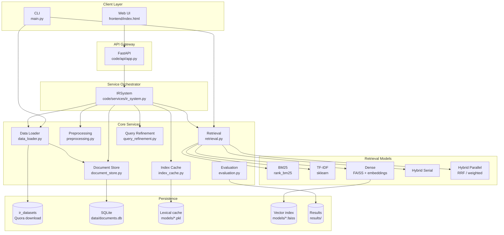

---

## 2. SQLite Document Storage

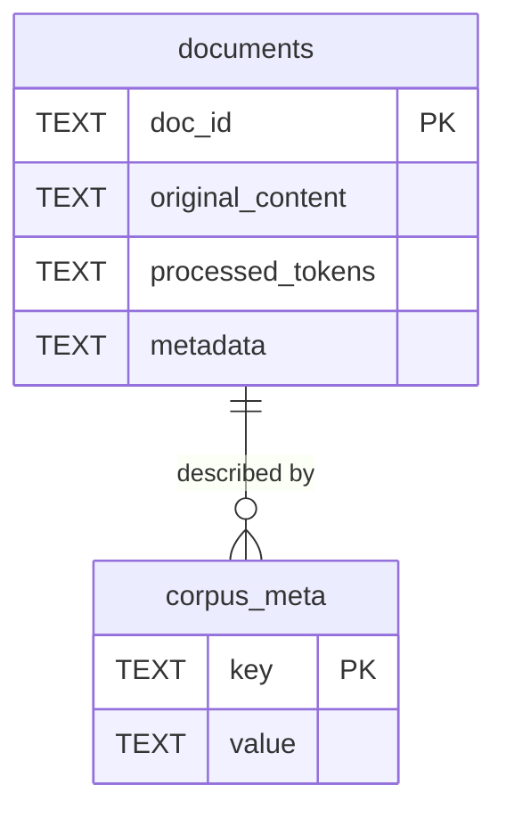

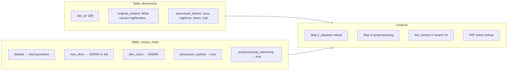

**File:** `data/documents.db`  
**Not stored in DB:** BM25, TF-IDF, inverted index, FAISS (those live in `models/`)

---

## 3. Full Storage & Cache Layers

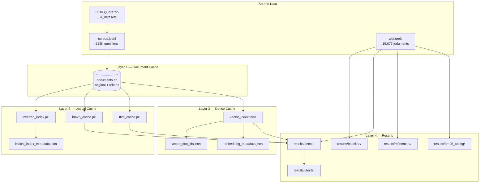

---

## 4. Load Index Flow (API / UI)

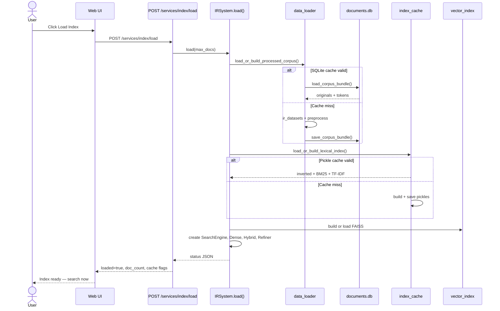

**Note:** Search also calls `load()` automatically if not loaded yet (`_ensure_loaded()`).

---

## 5. Search Request Flow

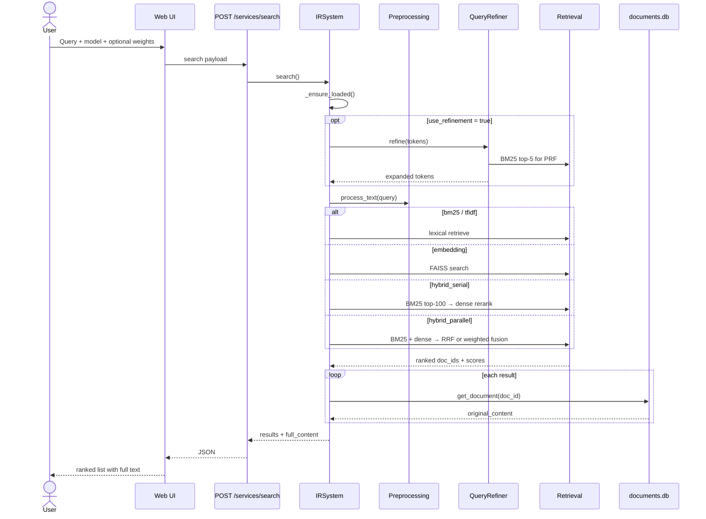

---

## 6. Retrieval Models Comparison

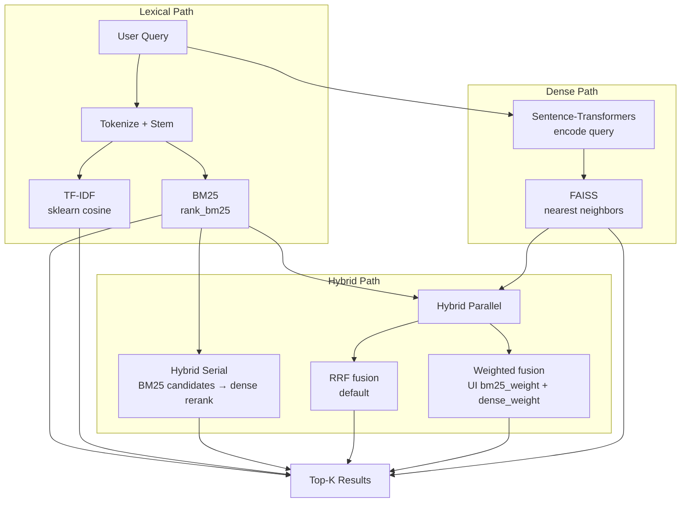

| Model | Method | Best for |
|-------|--------|----------|
| BM25 | Term matching + IDF | Exact word overlap |
| TF-IDF | Cosine on sparse vectors | Baseline lexical |
| Dense | Semantic embeddings | Paraphrases / synonyms |
| Hybrid Serial | BM25 filter → dense rerank | Precision at top |
| Hybrid Parallel | Both paths fused | Balance lexical + semantic |

---

## 7. Hybrid Parallel — Weighted Fusion

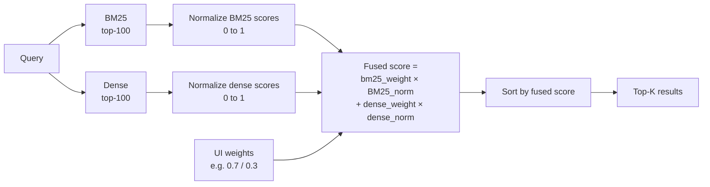

**UI test:** same query with `1.0/0.0` vs `0.0/1.0` vs `0.5/0.5` — rank order should change.

---

## 8. Query Refinement Pipeline

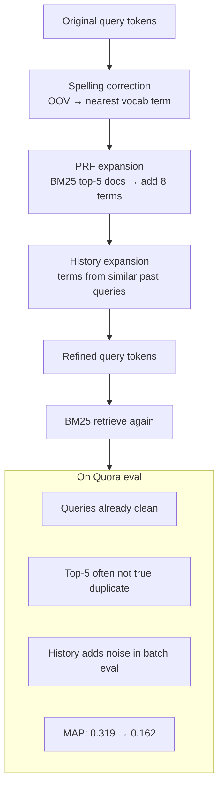

---

## 9. CLI Evaluation Pipeline

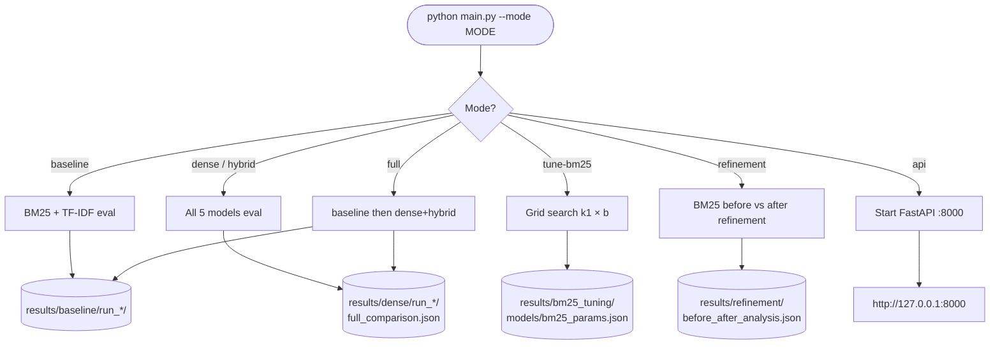

---

## 10. Dataset Structure (BEIR Quora)

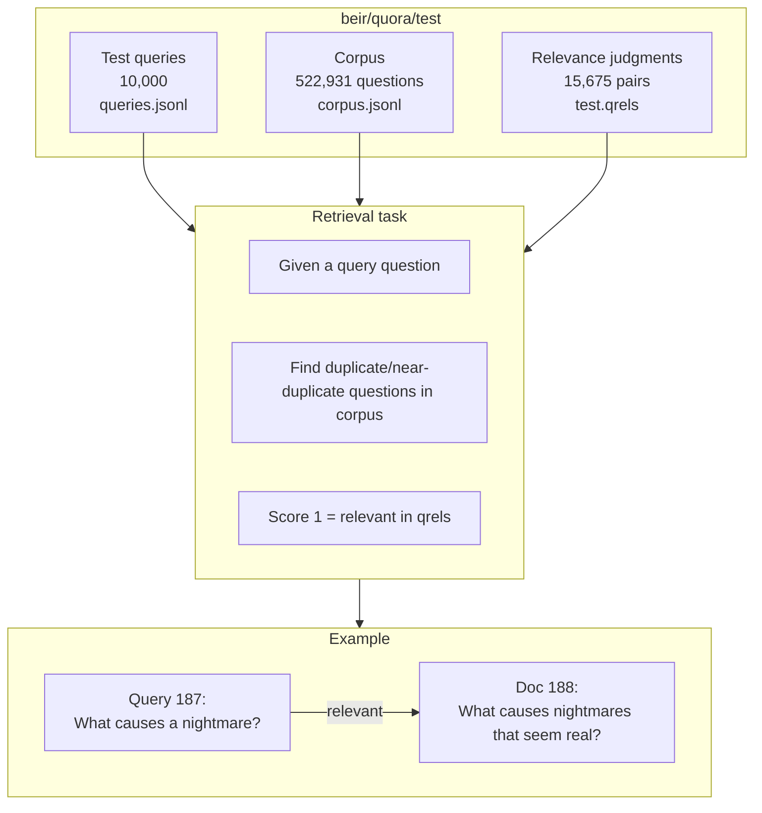

---

## 11. Cache Invalidation — When to Rebuild

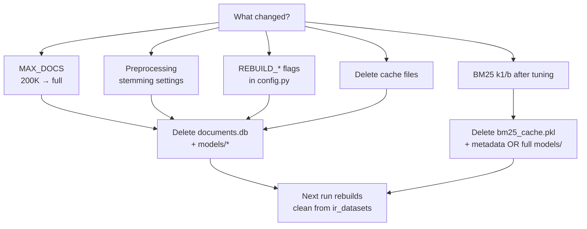

| Delete this | When |
|-------------|------|
| `data/documents.db` | Change doc count or preprocessing |
| `models/*.pkl` | Lexical cache invalid |
| `models/*.faiss` | Rebuild dense index |
| `data/beir/` | Force re-download (usually keep) |

---

## 12. End-to-End Data Lifecycle

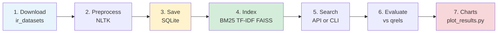

---

## Export for Report

1. Open [mermaid.live](https://mermaid.live)
2. Paste any diagram block
3. Export **PNG** or **SVG**
4. Recommended slides:
   - **Section 1** — System architecture
   - **Section 3** — Storage layers
   - **Section 6** — Retrieval models
   - **Section 10** — Dataset

---

*Updated for IR Project 2026 — includes SQLite storage, disk caches, hybrid weights, and refinement.*
