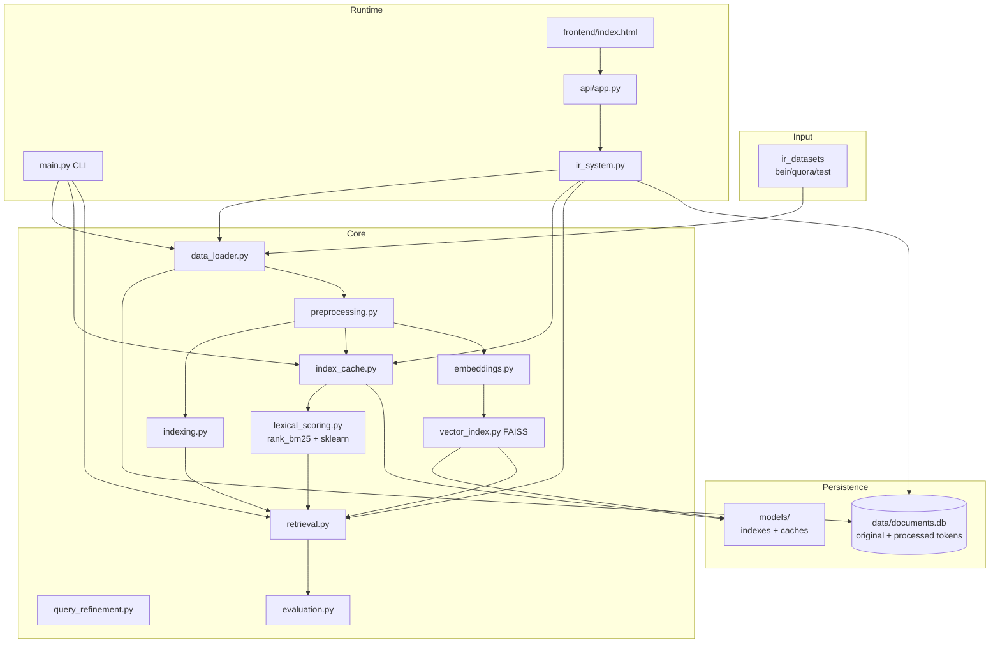
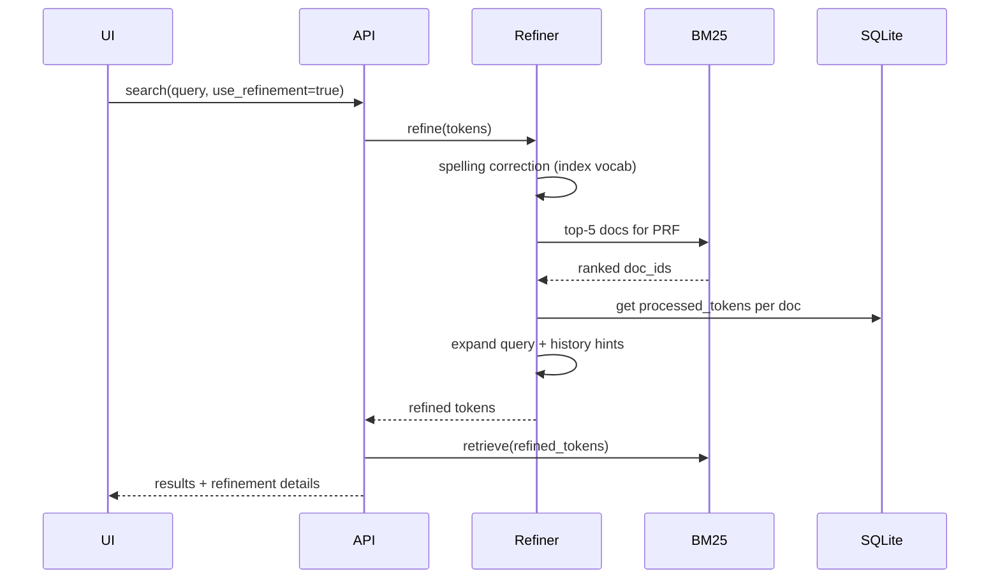

# IR Project 2026 — Complete Project Guide

This document explains **every important file**, **how they connect**, and **all execution scenarios** (CLI, API, caching, retrieval models).

---

## 1. Big Picture



**Two ways to run the system:**

| Path | Entry | Purpose |
|------|--------|---------|
| **CLI** | `python main.py --mode <mode>` | Batch evaluation, tuning, experiments |
| **API + UI** | `python main.py --mode api` | Interactive search via browser |

---

## 2. Directory Layout

```
IR-2026-project/
├── code/                    # All Python source
├── frontend/index.html      # Web search UI
├── docs/                    # Architecture + this guide
├── data/                    # Downloaded dataset + documents.db
├── models/                  # Cached indexes and tuned params
├── results/                 # Evaluation JSON outputs
├── logs/                    # Daily log files
├── requirements.txt
└── README.md
```

---

## 3. File-by-File Reference

### 3.1 Configuration & utilities

| File | Role |
|------|------|
| **`code/config.py`** | Single source of truth: paths, `MAX_DOCS`, `TOP_K`, BM25 defaults, hybrid settings, refinement settings, cache paths, API host/port. Creates `data/`, `models/`, `results/`, `logs/` on import. |
| **`code/utils.py`** | Logging (`setup_logger`), JSON/pickle save/load helpers used across the project. |

### 3.2 Data layer

| File | Role |
|------|------|
| **`code/data_loader.py`** | Loads Quora from `ir_datasets`. Functions: `load_dataset`, `get_documents`, `get_queries`, `get_qrels`, `select_eval_queries`, `load_or_build_processed_corpus` (SQLite-aware), `load_and_persist_documents`. |
| **`code/document_store.py`** | **SQLite persistence** (`data/documents.db`). Stores `doc_id`, `original_content`, `processed_tokens`, `metadata`. Supports cache checks, full corpus load, bundle load (original + tokens), `get_document(doc_id)`, upgrade path when only originals exist. |

### 3.3 Text processing

| File | Role |
|------|------|
| **`code/preprocessing.py`** | `TextPreprocessor`: lowercase, remove punctuation, tokenize (NLTK), stopwords, stemming. `process_text()` for one string; `process_collection()` for `{doc_id: text}`. |

### 3.4 Indexing & lexical scoring

| File | Role |
|------|------|
| **`code/indexing.py`** | `InvertedIndex`: postings list `{term: {doc_id: tf}}`, document frequencies, doc lengths, avg doc length. Used for **PRF / query refinement** and as supporting structure. Serializable via `to_state()` / `from_state()`. |
| **`code/lexical_scoring.py`** | Library-backed retrieval models: **`BM25Cache`** (`rank_bm25.BM25Okapi`) and **`TfidfCache`** (`sklearn.TfidfVectorizer` + cosine similarity). Handles empty documents and NaN scores. |
| **`code/index_cache.py`** | **Disk cache manager** for inverted index + BM25 + TF-IDF. Validates metadata (dataset, doc count, preprocessing, BM25 k1/b, cache version). `load_or_build_lexical_index()` is the main entry used by CLI and API. |

### 3.5 Dense retrieval

| File | Role |
|------|------|
| **`code/embeddings.py`** | `EmbeddingModel`: loads `sentence-transformers/all-MiniLM-L6-v2`, encodes documents/queries, saves/loads embedding metadata for FAISS cache validation. |
| **`code/vector_index.py`** | FAISS index: `build`, `save`, `load`, `search`, `score_candidates` (for serial hybrid re-rank). |

### 3.6 Retrieval orchestration

| File | Role |
|------|------|
| **`code/retrieval.py`** | **`SearchEngine`**: BM25 / TF-IDF via caches. **`DenseSearchEngine`**: FAISS + embeddings. **`HybridSearchEng ine`**: serial (BM25 → dense re-rank) and parallel (BM25 + dense → RRF or weighted fusion). Batch methods for evaluation. |

### 3.7 Query refinement & evaluation

| File | Role |
|------|------|
| **`code/query_refinement.py`** | `QueryRefiner`: spelling correction, PRF expansion, history-based suggestions. Fetches processed tokens from memory or SQLite per document. |
| **`code/evaluation.py`** | `Evaluator`: MAP, Recall, Precision@k, nDCG@k. `compare_models`, `before_after_analysis`, save comparison JSON. |
| **`code/bm25_tuning.py`** | Grid search over k1/b using `rank_bm25`, corpus stats, query-length bucket analysis, theoretical justification text. Saves best params to `models/bm25_params.json`. |

### 3.8 SOA (Service-Oriented Architecture)

| File | Role |
|------|------|
| **`code/services/ir_system.py`** | **Central orchestrator** for the API: load indexes, search, refine, status, `get_document`. Loads full corpus from SQLite or ir_datasets, lexical pickles, FAISS, and embedding model at startup. |
| **`code/api/app.py`** | FastAPI app: serves UI, `/health`, search, refine, document lookup, hybrid settings, evaluation summary. |
| **`frontend/index.html`** | English UI: model select, hybrid weights, Load Index, Search, refinement preview, full document display. |

### 3.9 CLI entry point

| File | Role |
|------|------|
| **`code/main.py`** | Runs all batch pipelines: `baseline`, `dense`, `hybrid`, `full`, `tune-bm25`, `refinement`, `api`. Shared helpers for vector index build/load and lexical index load. |

### 3.10 Documentation

| File | Role |
|------|------|
| **`docs/Architecture_Diagram.md`** | Mermaid SOA diagrams for the report. |
| **`docs/Requirements_Gap_Report.md`** | Gap analysis vs course PDF (if present). |
| **`docs/PROJECT_GUIDE.md`** | This file. |
| **`README.md`** | Quick start, install, run commands. |

---

## 4. On-Disk Artifacts

### `data/`

| Path | Content |
|------|---------|
| `data/beir/quora/...` | Raw dataset files downloaded by `ir_datasets` |
| `data/documents.db` | SQLite: originals + processed tokens + corpus metadata |

### `models/`

| Path | Content |
|------|---------|
| `inverted_index.pkl` | Serialized inverted index |
| `bm25_cache.pkl` | `BM25Okapi` + doc_ids |
| `tfidf_cache.pkl` | `TfidfVectorizer` + sparse matrix |
| `lexical_index_metadata.json` | Fingerprint for lexical cache validity |
| `vector_index.faiss` | FAISS dense index |
| `vector_doc_ids.json` | Doc ID order in FAISS |
| `embedding_metadata.json` | Fingerprint for vector cache validity |
| `bm25_params.json` | Tuned k1, b (after `tune-bm25`) |

### `results/`

| Path | Content |
|------|---------|
| `results/baseline/run_<N>/` | TF-IDF + BM25 metrics |
| `results/dense/run_<N>/` | Dense + hybrid comparison |
| `results/bm25_tuning/run_<N>/` | Grid search report |
| `results/refinement/run_<N>/` | Before/after refinement analysis |

### `logs/`

| Path | Content |
|------|---------|
| `logs/YYYY-MM-DD.log` | Timestamped INFO logs per component |

---

## 5. All Scenarios

### Scenario A — First-time full setup (cold start)

**Trigger:** No `documents.db`, no `models/` caches.

```
ir_datasets → get_documents → preprocess → save SQLite
           → build inverted index + BM25 + TF-IDF → save pickles
           → encode embeddings → build FAISS → save
```

**CLI:** `python main.py --mode full --max-docs 200000`  
**API:** Click **Load Index** (slowest path; may take tens of minutes first time)

---

### Scenario B — Warm load (typical after first run)

**Trigger:** `documents.db` has originals + processed tokens; lexical and FAISS caches valid.

```
load_or_build_processed_corpus()
  → SQLite bundle hit: skip ir_datasets + preprocessing
  → Load 200K originals + token lists into RAM from SQLite
load_or_build_lexical_index()
  → Pickle cache hit: load inverted + BM25 + TF-IDF (~1–2 s)
_build_or_load_vector_index()
  → FAISS cache hit: load index from disk (~1 s)
  → EmbeddingModel() still loads sentence-transformers (~15–20 s first time)
IR system ready (faster than cold start, but still loads full corpus + embedder)
```

**Logs you should see:**
```
Inverted index cache hit ...
BM25 cache hit ...
TF-IDF cache hit ...
Vector index cache hit ...
IR system ready in Xs
```

**Status flags** (`GET /health`): `documents_cached: true`, `inverted_index_cached: true`, `bm25_cached: true`, `tfidf_cached: true`, `vector_index_cached: true`.

---

### Scenario C — Cache invalidation (rebuild required)

Caches are **ignored** and rebuilt when any of these change:

| Change | Affected caches |
|--------|-----------------|
| `MAX_DOCS` or dataset | All |
| Preprocessing settings (stemming) | SQLite processed tokens, lexical caches |
| BM25 k1/b (after tuning) | `bm25_cache.pkl`, metadata |
| `REBUILD_LEXICAL_INDEX = True` | Lexical pickles |
| `REBUILD_VECTOR_INDEX = True` | FAISS + embedding metadata |
| `LEXICAL_CACHE_VERSION` bump in code | Lexical pickles |

---

### Scenario D — CLI `baseline`

**Command:** `python main.py --mode baseline`

```
Load dataset + queries + qrels
load_or_build_processed_corpus → SQLite
load_or_build_lexical_index → pickles
BM25 batch retrieve + TF-IDF batch retrieve
Evaluate MAP, Recall, Precision@10, nDCG@10
Save → results/baseline/run_<max_docs>/
```

**Does not** run dense, hybrid, or refinement.

---

### Scenario E — CLI `dense` / `hybrid`

**Command:** `python main.py --mode hybrid --hybrid-type both`

```
Same data + lexical setup as baseline
Build or load FAISS
Retrieve: BM25, TF-IDF, Embedding
Hybrid Serial: BM25 top-100 → dense re-rank
Hybrid Parallel: BM25 + dense → RRF fusion
Compare all models → results/dense/run_<N>/full_comparison.json
```

**Options:** `--hybrid-type serial | parallel | both | none`

---

### Scenario F — CLI `full`

**Command:** `python main.py --mode full`

Runs **Scenario E** then **Scenario F** sequentially (complete project evaluation).

---

### Scenario G — CLI `tune-bm25`

**Command:** `python main.py --mode tune-bm25`

```
Load corpus + build/load lexical index
Grid search k1 × b (rank_bm25 per combination)
Pick best by MAP (or configured metric)
Save models/bm25_params.json
Save report → results/bm25_tuning/run_<N>/
```

Next load uses tuned k1/b; lexical cache invalidates if params differ from cached metadata.

---

### Scenario H — CLI `refinement`

**Command:** `python main.py --mode refinement`

```
Load corpus + BM25 index
Evaluate BM25 on all qrel queries (BEFORE)
Apply QueryRefiner to every query (batch PRF)
Evaluate BM25 again (AFTER)
Save before_after_analysis.json
```

On Quora 200K/10K, refinement **hurt** MAP (documented in results).

---

### Scenario I — API `api` + Web UI

**Command:** `python main.py --mode api`

| User action | Backend flow |
|-------------|--------------|
| Open `/` | Serves `frontend/index.html` |
| **Load Index** | `POST /services/index/load` → `IRSystem.load()` |
| **Search** | `POST /services/search` → preprocess query → optional refine → retrieve → attach full text from SQLite |
| **Preview Refinement** | `POST /services/refine` |
| **Health** | `GET /health` → cache flags + session stats |
| **Get document** | `GET /services/documents/{doc_id}` |

### API endpoint reference

| Method | Path | Description |
|--------|------|-------------|
| `GET` | `/` | Web UI (`frontend/index.html`) |
| `GET` | `/docs` | Swagger API documentation |
| `GET` | `/health` | System status + session stats |
| `POST` | `/services/index/load?max_docs=` | Build or load all indexes |
| `GET` | `/services/index/status` | Same as health status block |
| `POST` | `/services/preprocess` | `{"text": "..."}` → tokens |
| `POST` | `/services/refine` | `{"text": "..."}` → refinement details |
| `POST` | `/services/search` | Search (see payload below) |
| `GET` | `/services/documents/{doc_id}` | Full stored document |
| `GET` | `/services/evaluation/summary` | Latest metrics from `results/` |
| `GET` | `/services/hybrid/settings` | Serial/parallel hybrid config |
| `GET` | `/services/bm25/params` | Tuned or default k1/b |

**Search request example:**

```json
{
  "query": "how to learn python",
  "model": "hybrid_parallel",
  "top_k": 10,
  "use_refinement": false,
  "bm25_weight": 0.6,
  "dense_weight": 0.4
}
```

**Valid `model` values:** `bm25`, `tfidf`, `embedding`, `hybrid_serial`, `hybrid_parallel`

---

## 6. Retrieval Models (search scenarios)

| Model | `model` value | What happens |
|-------|---------------|--------------|
| **BM25** | `bm25` | `BM25Okapi.get_scores()` via cached model |
| **TF-IDF** | `tfidf` | sklearn vectorizer + cosine similarity |
| **Dense** | `embedding` | Query embedding → FAISS nearest neighbors |
| **Hybrid Serial** | `hybrid_serial` | BM25 top-100 → dense re-rank top-k |
| **Hybrid Parallel** | `hybrid_parallel` | BM25 + dense top-100 each → RRF or **weighted fusion** (UI weights) |

### Hybrid Parallel weights (UI / API)

```json
{
  "model": "hybrid_parallel",
  "bm25_weight": 0.7,
  "dense_weight": 0.3
}
```

When weights are sent, fusion switches to **weighted** normalized score combination.

---

## 7. Query Refinement Flow



---

## 8. Evaluation Metrics

Implemented in `evaluation.py`:

| Metric | Meaning |
|--------|---------|
| **MAP** | Mean Average Precision over qrel queries |
| **Recall** | Fraction of relevant docs retrieved |
| **Precision@10** | Precision in top 10 results |
| **nDCG@10** | Normalized DCG at rank 10 |

Used in all CLI eval modes and saved as JSON under `results/`.

---

## 9. Config Cheat Sheet

| Want to… | Set in `config.py` |
|----------|-------------------|
| Use full Quora corpus | `MAX_DOCS = None` |
| Faster dev eval | `MAX_EVAL_QUERIES = 100` |
| Force rebuild lexical caches | `REBUILD_LEXICAL_INDEX = True` |
| Force rebuild FAISS | `REBUILD_VECTOR_INDEX = True` |
| Change hybrid fusion default | `HYBRID_FUSION_METHOD = "rrf"` or `"weighted"` |
| Tune BM25 candidate depth | `HYBRID_SERIAL_CANDIDATES`, `HYBRID_PARALLEL_DEPTH` |

---

## 10. Typical Workflows

### Student demo (UI)

1. `cd code && python main.py --mode api`
2. Open http://127.0.0.1:8000
3. **Load Index** (fast if SQLite + pickles exist; embedding model still loads)
4. Search with BM25
5. Try Hybrid Parallel with different weights
6. Check **System Status** for cache flags

### Report experiments

1. `python main.py --mode baseline --max-docs 200000`
2. `python main.py --mode hybrid --max-docs 200000`
3. `python main.py --mode tune-bm25 --max-docs 200000`
4. `python main.py --mode refinement --max-docs 200000`
5. Copy metrics from `results/` into report

### After code changes to preprocessing or BM25

1. Delete or set rebuild flags for `models/` lexical files
2. Optionally delete `data/documents.db` processed tokens (or full DB)
3. Re-run Load Index or CLI mode once to regenerate caches

---

## 11. Dependency Map (which file imports what)

```
main.py
 ├── config, utils, data_loader, preprocessing
 ├── index_cache, retrieval, evaluation, embeddings
 ├── vector_index, bm25_tuning, query_refinement, document_store

ir_system.py
 ├── data_loader, preprocessing, index_cache, retrieval
 ├── embeddings, vector_index, bm25_tuning, query_refinement, document_store

retrieval.py
 └── lexical_scoring (via SearchEngine caches)

index_cache.py
 ├── indexing, lexical_scoring, config, utils

api/app.py
 └── services.ir_system
```

---

## 12. Troubleshooting

| Problem | Likely cause | Fix |
|---------|--------------|-----|
| Slow Load Index | Loading 200K docs from SQLite + embedding model + FAISS | Normal on warm start; use smaller `--max-docs` for dev |
| NLTK download errors | No internet | Pre-download NLTK data or use cached processed SQLite |
| `NaN` in search scores | Empty tokenized documents | Fixed in `lexical_scoring.py`; rebuild BM25 cache |
| Pickle error on TF-IDF | Lambda in vectorizer | Fixed with module-level functions; rebuild cache |
| Refinement hurts MAP | PRF noise on Quora | Document in report; use refinement off for demo |
| Stale results after tuning | Lexical cache metadata mismatch | Automatic rebuild on next load |

---

## 13. Quick Reference — CLI Commands

```powershell
cd code

python main.py --mode baseline
python main.py --mode dense
python main.py --mode hybrid --hybrid-type both
python main.py --mode full
python main.py --mode tune-bm25
python main.py --mode refinement
python main.py --mode api

# Dev shortcuts
python main.py --mode hybrid --max-docs 5000 --max-queries 100
```

---

*Last updated to match the codebase: SQLite persistence, rank_bm25 + sklearn, disk caches, FastAPI UI.*
